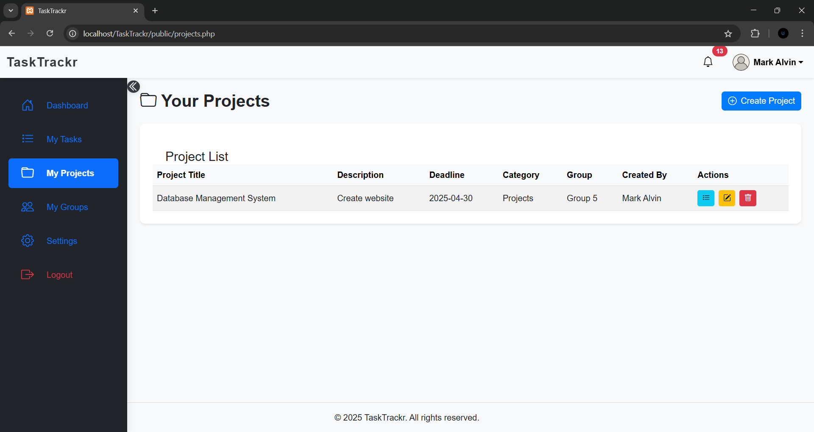
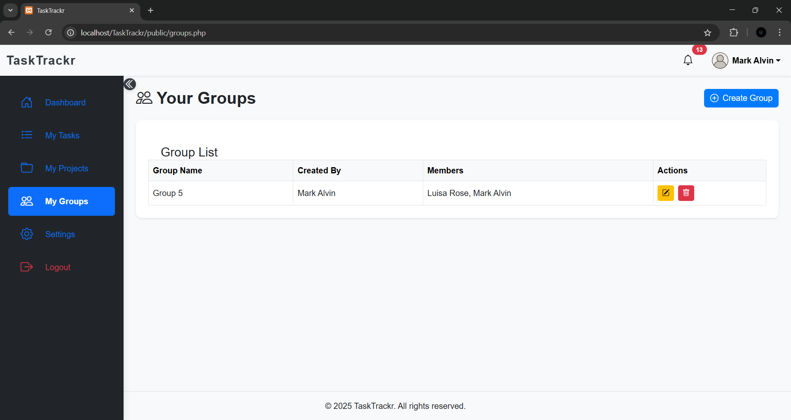

# TaskTrackr

TaskTrackr is a lightweight, modern task management application designed to help users organize and track their daily tasks efficiently.

---

## 🚀 Features

- Add, edit, and delete tasks
- Mark tasks as completed
- Categorize tasks by priority or tags
- Group and project management
- In-app and email notifications for important events
- Automated reminders for upcoming and overdue tasks
- User profile and settings (custom reminder days)
- Responsive, modern, and user-friendly interface

---

## 📸 Screenshots

>
> 
> 
> 
> 

---

## ⚡ Quick Start

1. **Clone the repository:**
    ```bash
    git clone https://github.com/markalvincadangin/TaskTrackr.git
    cd TaskTrackr
    ```
2. **Install XAMPP** and start Apache/MySQL ([Download XAMPP](https://www.apachefriends.org/)).
3. **Import the database:**
    - Open [http://localhost/phpmyadmin](http://localhost/phpmyadmin)
    - Create a database named `tasktrackr`
    - Import `database/tasktrackr.sql`
4. **Configure the app:**
    - Edit `config/db.php` with your DB credentials.
5. **Configure email sending:**
    - Edit `includes/email_sender.php` with your SMTP settings (see below).
6. **Open the app:**
    - Go to [http://localhost/TaskTrackr](http://localhost/TaskTrackr)

---

## 🛠️ Setup Instructions

### 1. Install XAMPP
- Download and install XAMPP from [https://www.apachefriends.org/](https://www.apachefriends.org/).
- Start the Apache and MySQL services from the XAMPP Control Panel.

### 2. Configure the Database
- Open `phpMyAdmin` at [http://localhost/phpmyadmin](http://localhost/phpmyadmin)
- Create a new database named `tasktrackr`
- Import the schema from `database/tasktrackr.sql`

### 3. Configure the Application
- Edit `config/db.php`:
    ```php
    $host = 'localhost';
    $user = 'root';
    $password = ''; // Add your MySQL password if applicable
    $database = 'tasktrackr';
    ```

### 4. Configure Email Sending
- PHPMailer is included in `vendor/phpmailer/`
- Edit `includes/email_sender.php`:
    ```php
    $mail->Host = 'smtp.gmail.com';
    $mail->Username = 'your.email@gmail.com';
    $mail->Password = 'your_app_password';
    $mail->SMTPSecure = PHPMailer::ENCRYPTION_STARTTLS;
    $mail->Port = 587;
    ```
- For Gmail, use an [App Password](https://myaccount.google.com/apppasswords).

### 5. Start the Application
- Open your browser and go to [http://localhost/TaskTrackr](http://localhost/TaskTrackr)

---

## 🔔 Automated Task Reminders

TaskTrackr includes a script to automatically send reminders for upcoming and overdue tasks.

### How to Test Manually

1. Open Command Prompt and navigate to your project directory:
    ```sh
    cd C:\xampp\htdocs\TaskTrackr
    ```
2. Run the script:
    ```sh
    php actions\send_task_reminders.php
    ```
3. Check for new notifications in the app and reminder emails in your inbox.

### How to Automate with Windows Task Scheduler

1. Open **Task Scheduler** from the Start menu.
2. Click **Create Basic Task...**
3. Name it (e.g., `TaskTrackr Send Task Reminders`).
4. Set the trigger to **Daily** at your preferred time.
5. Set the action to **Start a program**:
    - **Program/script:**  
      `C:\xampp\php\php.exe`
    - **Add arguments:**  
      `C:\xampp\htdocs\TaskTrackr\actions\send_task_reminders.php`
    - **Start in:**  
      `C:\xampp\htdocs\TaskTrackr\actions`
6. Finish and test by right-clicking the task and choosing **Run**.

---

## 📂 Folder Structure

```
TaskTrackr/
│
├── assets/         # CSS, images
├── config/         # Database configuration
├── database/       # SQL schema
├── includes/       # Shared components (header, sidebar, footer, alerts)
├── public/         # Main entry points (login, register, dashboard, etc.)
├── actions/        # Form handlers and backend logic
├── vendor/         # PHPMailer 
└── README.md
```

---

## 📦 Dependencies

- [PHPMailer](https://github.com/PHPMailer/PHPMailer) (included)
- Bootstrap 5 (CDN)
- Bootstrap Icons (CDN)

---

## 🖥️ Usage

1. Open your browser and navigate to [http://localhost/TaskTrackr](http://localhost/TaskTrackr)
2. Register a new account or log in.
3. Start managing your tasks, projects, and groups!
4. Set your reminder preferences and dark mode in the Settings page.

---

## ⚠️ Known Issues / Limitations

- No password reset functionality yet.
- No mobile push notifications.
- Email notifications depend on correct SMTP setup.

---

## ♿ Accessibility & Browser Support

- Uses semantic HTML and ARIA labels.
- Tested on Chrome, and Edge.

---

## 🙋 Support

For issues, open a GitHub issue or contact [markalvincadangin@gmail.com](mailto:markalvincadangin@gmail.com).

---

## 🤝 Contributing

Contributions are welcome! Please follow these steps:

1. Fork the repository.
2. Create a new branch:
    ```bash
    git checkout -b feature-name
    ```
3. Commit your changes:
    ```bash
    git commit -m "Add feature-name"
    ```
4. Push to the branch:
    ```bash
    git push origin feature-name
    ```
5. Open a pull request.

---

## 🙏 Acknowledgments

- Built with PHP and XAMPP.
- Inspired by the need for simple task management tools.
- Special thanks to **Group 5** for their contributions:
  - Brillantes, Luisa Rose
  - Cadangin, Mark Alvin
  - Calisa, Eliza May
  - Dela Cruz, Christian Paul
  - Manago, Tristan
  - Serra, Alyanna Bianca
  - Tacleon, Ellen Mae